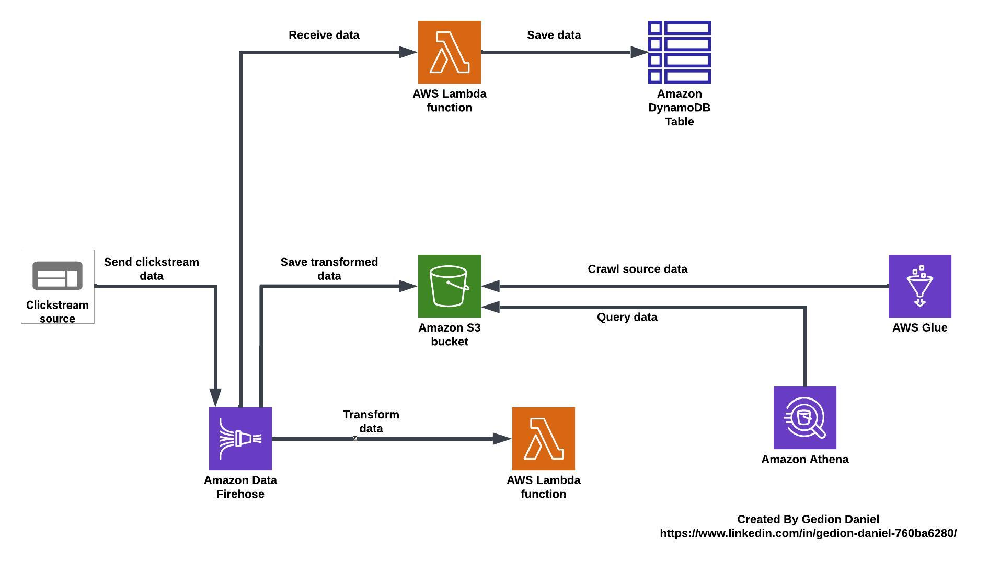
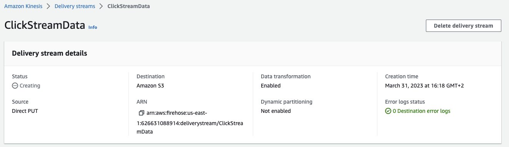
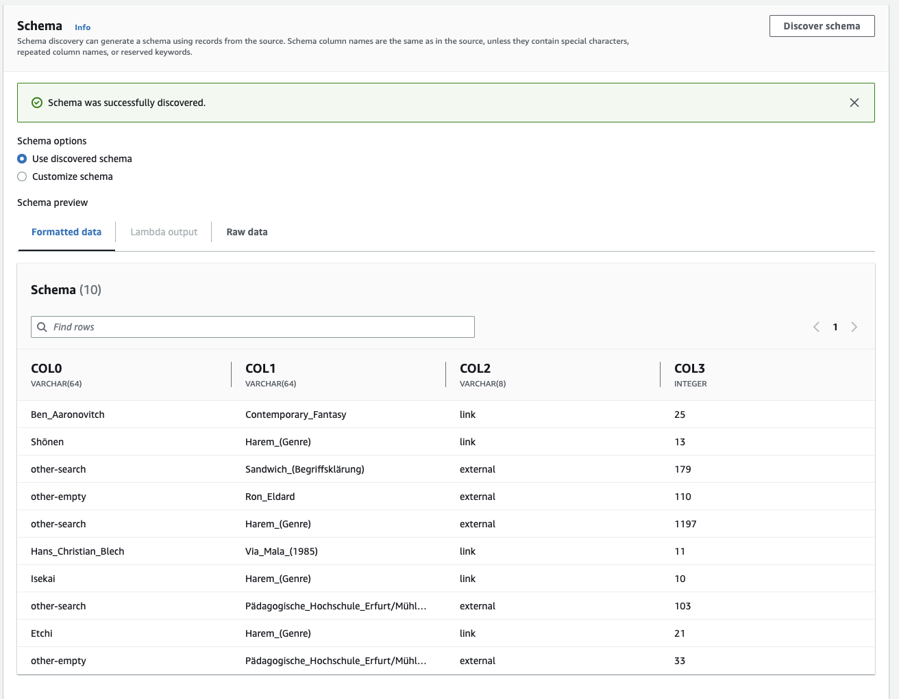

# Data Ingestion Methods

[](https://docs.aws.amazon.com/quicksight/latest/user/signing-up.html)
[](https://aws.amazon.com/dynamodb/)
[](https://aws.amazon.com/kinesis/firehose/)
[](https://aws.amazon.com/s3/)
[](https://aws.amazon.com/lambda/)

## Project Source
This project was developed as part of the AWS Cloud Quest: Solutions Architect learning path (https://explore.skillbuilder.aws/learn/courses/7636/cloud-quest). AWS Cloud Quest provides hands-on experience in architecting cloud solutions through real-world scenarios.

## Project Description:

This practice lab provides an overview of how to ingest and preprocess clickstream data using Amazon Kinesis Data Firehose, Amazon S3, and AWS Lambda. The lab objectives are as follows:

- Create an Amazon Kinesis Data Firehose delivery stream.
- Ingest and store clickstream data in an Amazon S3 bucket.
- Configure real-time analytics to count active page views.

<p align="center">
  
</p>

## Table of Contents

- [Requirements](#requirements)
- [Steps](#Steps)
- [Conclusion](#conclusion)
- [Contributors](#contributors)

## Requirements

To complete this quest, you will need access to the following AWS services:

- Amazon Kinesis Data Firehose
- Amazon S3
- AWS Lambda
- Amazon DynamoDB

## Steps

### Step 1: Create a Kinesis Data Firehose delivery stream

1. Open the Kinesis Data Firehose console.
2. Click Create delivery stream.
3. In the Create delivery stream wizard, enter a name for your delivery stream (e.g., ClickStreamData).
4. Choose Direct PUT or other sources as the source.
5. Choose Amazon S3 as the destination.
6. Configure the destination S3 bucket, prefix, and compression options.
7. Review and confirm the settings, then create the delivery stream.

<p align="center">
  
</p>

### Step 2: Ingest clickstream data into S3

1. In the Kinesis Data Firehose console, select your delivery stream.
2. Click Test with demo data to generate sample data.
3. Review and confirm the data transformation settings, then click Next.
4. Choose the delivery stream you created in Step 1 as the destination.
5. Review and confirm the settings, then click Send test event to ingest the data into S3.

### Step 3: Preprocess data with Lambda

Open the AWS Lambda console.

Click Create function and choose Author from scratch.

Enter a name for your function (e.g., PreprocessClickstreamData) and choose Python 3.9 as the runtime.

Copy and paste the following code into the editor:

```python
from datetime import datetime
import pandas as pd
import boto3
import os
import base64

s3 = boto3.client('s3')
data_bucket = os.environ.get('DATA_BUCKET_NAME')

def handler(event, context):
    response = {"records": []}
    labels = ['prev', 'curr', 'type', 'n']
    
    for record in event.get('records'):
        records = []
        data = base64.b64decode(record.get('data')).decode('utf-8')
        lines = data.split('\n')

        for line in lines:
            if line == "":
                continue
            try:
                cols = line.split('\t')
                records.append((cols[0], cols[1], cols[2], cols[3]))
            except:
                continue

        df = pd.DataFrame.from_records(records, columns=labels)
        response['records'].append({
            "recordId": record['recordId'],
            "result": "Ok",
            "data": base64.b64encode(df.to_csv(header=False, index=False).encode('utf-8'))
        })

    return response
```

<p align="center">
  
</p>

## Conclusion

In conclusion, backing up your data is essential to ensure its safety and continuity in the event of an unexpected event. AWS provides multiple solutions for backing up your data, including creating a custom backup vault, configuring automated backup plans, and using tags to manage resources. With the knowledge gained from this guide, you can now confidently create and manage backup solutions for your AWS resources, ensuring that your data is always protected and available. Remember to regularly review and test your backup plans to ensure their effectiveness and make any necessary adjustments.

## Contributors

[Gedion Daniel](https://gediondaniel.dev/)
[LinkedIn](https://www.linkedin.com/in/gedion-daniel-760ba6280/)
