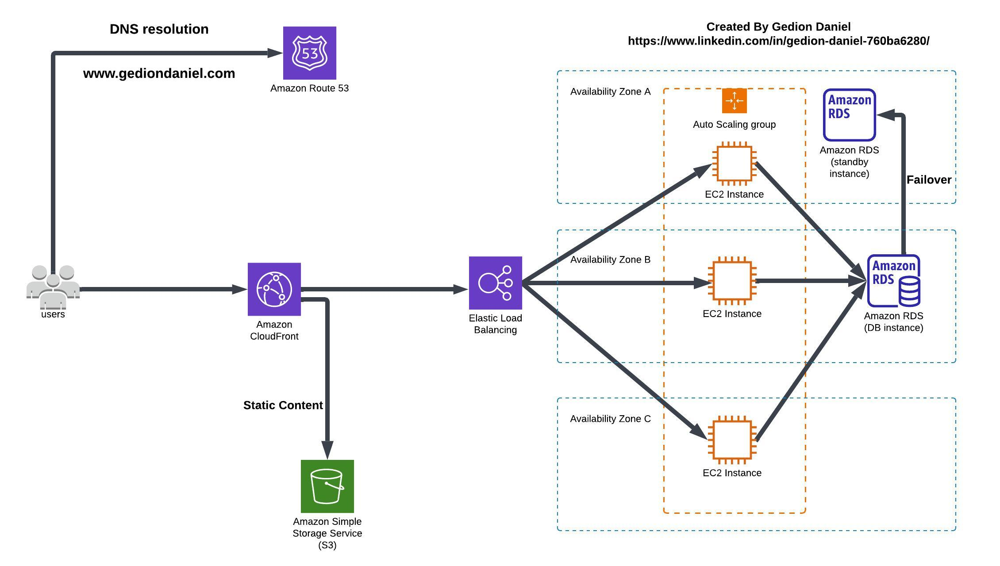

# Build Highly Available Web Application on AWS

## Project Source
This project was developed as part of the AWS Cloud Quest: Solutions Architect learning path (https://explore.skillbuilder.aws/learn/courses/7636/cloud-quest). AWS Cloud Quest provides hands-on experience in architecting cloud solutions through real-world scenarios. This implementation demonstrates the practical application of AWS best practices for creating highly available web applications.

## Project Description:

The infrastructure implements a fault-tolerant web application that automatically scales based on demand. By leveraging AWS's global infrastructure and services, the application maintains high availability and optimal performance under varying load conditions.

## Architecture Diagram

  

## AWS Services

The infrastructure utilizes the following AWS services:

- **Amazon Route 53**: Manages DNS routing and domain configuration
- **Amazon CloudFront**: Delivers content through a global CDN network
- **Amazon S3**: Stores static assets (images, videos)
- **Elastic Load Balancer**: Distributes traffic across multiple servers
- **EC2 Auto Scaling**: Automatically adjusts server capacity based on demand
- **Amazon CloudWatch**: Monitors performance and triggers scaling actions

## Key Features

- Multi-availability zone deployment for redundancy
- Automatic scaling based on CPU utilization (threshold: 80%)
- Global content delivery through CloudFront
- Health monitoring and automated instance replacement
- Cost optimization through dynamic resource allocation

## Deployment Steps

1. Configure Auto Scaling Group with Application Load Balancer
2. Set up Load Balancer health checks
3. Enable multi-availability zone deployment
4. Configure CloudWatch monitoring

## Contributors

[Gedion Daniel](https://gediondaniel.dev/)
[LinkedIn](https://www.linkedin.com/in/gedion-daniel-760ba6280/)
